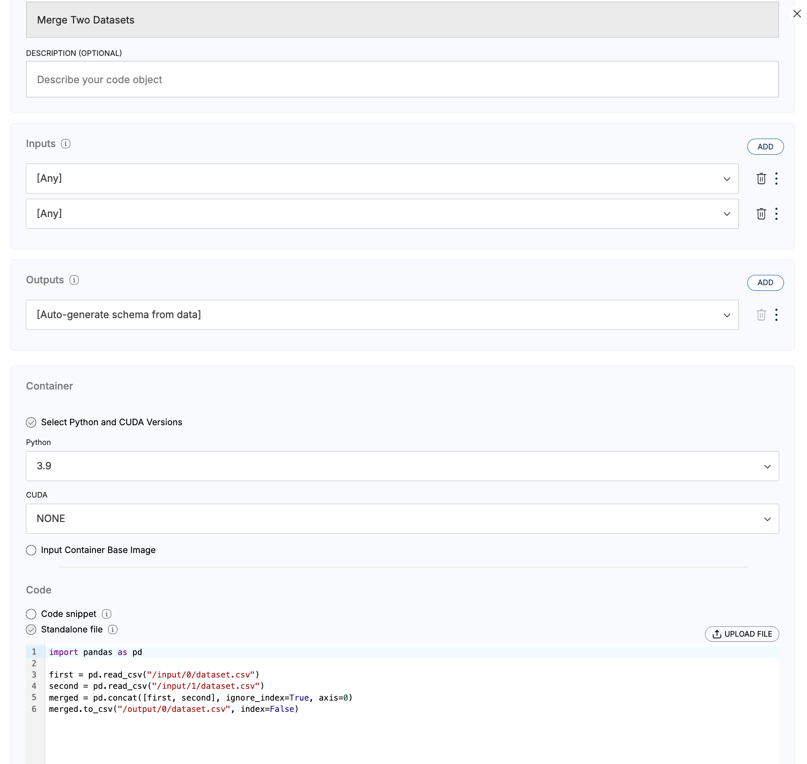
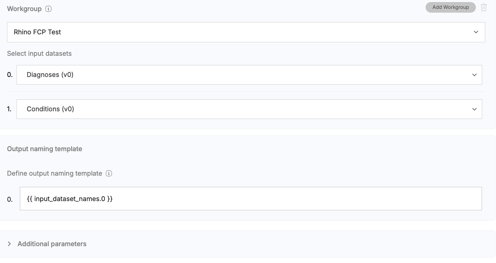

# Concatenate Two Datasets
 

### **Description**

This example provides Python code that can be used to remotely concatenate two input datasets into a single output dataset on a Rhino Client.

It shows how to:
* Process multiple input CSV files
* Merge the inputs into a single output CSV file

### **Instructions**
1. Give your Code Object a name
2. Add a second input schema (Click 'Add' in the Inputs box)
3. Specify input schemas (if neessary)
4. In the 'Code' box, select 'Standalone file'
5. Copy & paste conents of code.py into the code window

#### Run Code Object
1. When specifying the input datasets, specify the appropriate dataset in both dropdowns. 

 
# Getting Help
For additional support, please reach out to [support@rhinohealth.com](mailto:support@rhinohealth.com).