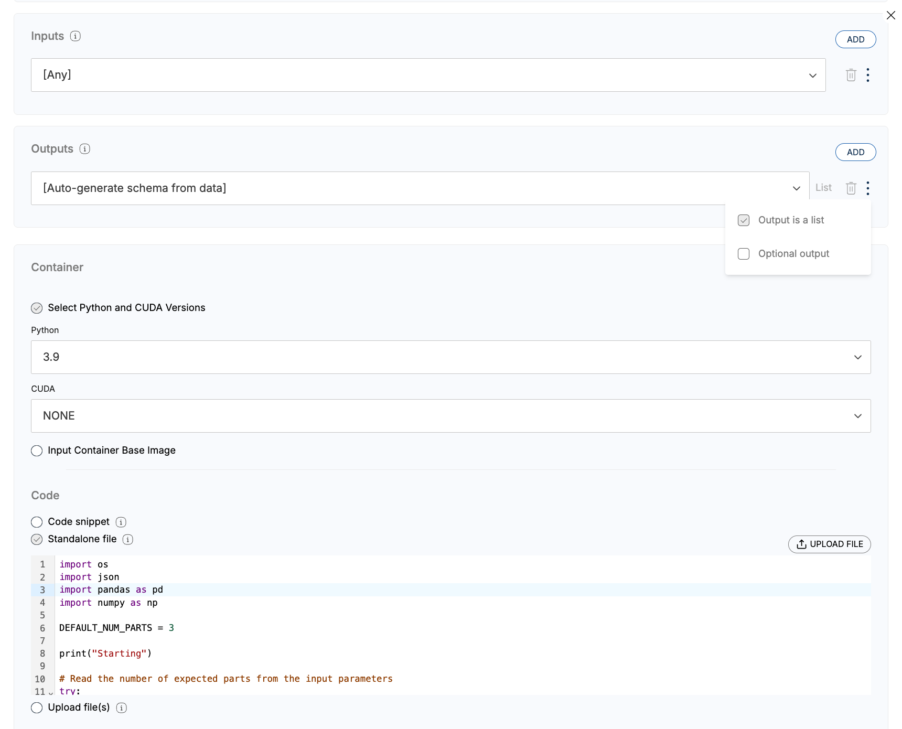

# Split Dataset Into Multiple Parts
 

### **Description**

This example provides Python code that can be used to remotely concatenate two or more input datasets into a single output dataset on a Rhino Client.

It shows how to:
* Process a single CSV input
* Split the input into multiple CSVs of equal size
* Output multiple CSVs

### **Instructions**
#### Create Code Object
1. Give your Code Object a name
2. Click the three dots (⋮) next to the input dropdown 
3. Select 'Output is a list' (This allows multiple outputs to be generated at Code Run; default is 3 outputs)
4. In the 'Code' box, select 'Standalone file'
5. Copy & paste conents of code.py into the code window

#### Run Code Object
1. When specifying the input datasets, select all relevant input datasets.

 
# Getting Help
For additional support, please reach out to [support@rhinohealth.com](mailto:support@rhinohealth.com).