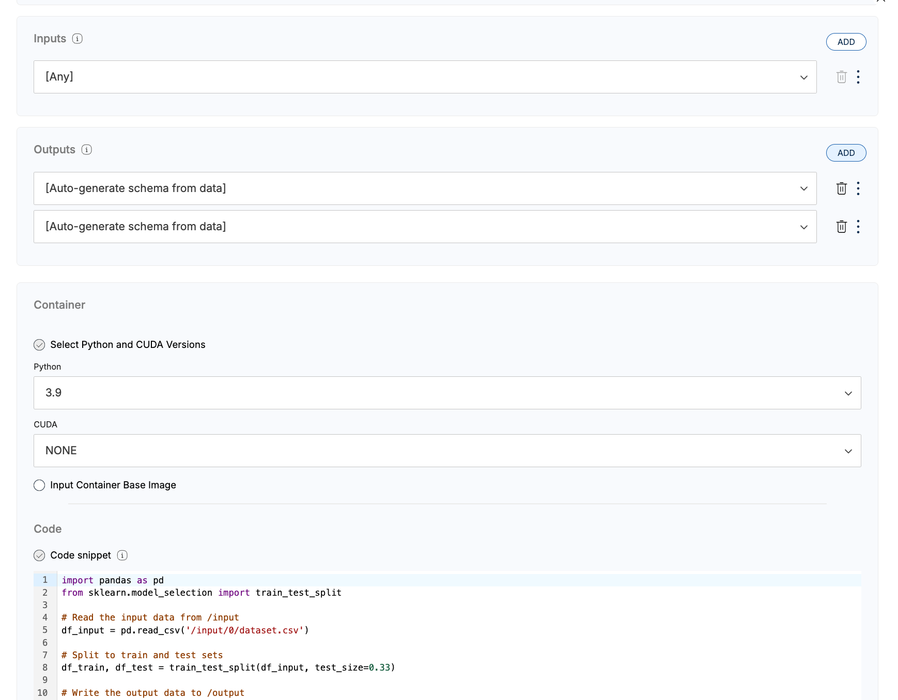

# Test Train Split
 

### **Description**

This example provides Python code that can be used to remotely concatenate two input datasets into a single output dataset on a Rhino Client.

It shows how to:
* Receive a single CSV as input
* Split the CSV into two output datasets
* Save two datasets as output

### **Instructions**
1. Give your Code Object a name
2. Add a second output schema (Click 'Add' in the Outputs box)
3. Specify input schemas (if necessary)
4. In the 'Code' box, select 'Standalone file'
5. Copy & paste contents of code.py into the code window
6. Specify the following requirements via Pip format
    numpy == 1.22.*
    pandas ~= 1.4.2
    scikit-learn==1.6.1

 
# Getting Help
For additional support, please reach out to [support@rhinohealth.com](mailto:support@rhinohealth.com).