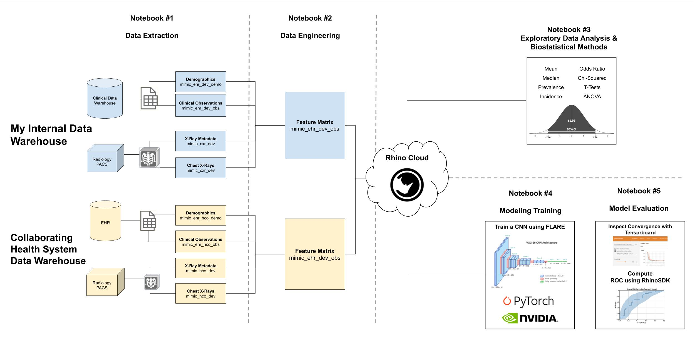

## Rhino's Federated Learning Sandbox: Using Jupyter Notebooks to train multimodal AI across multiple hospitals

Welcome to the Rhino Health Platform! Our series of five Jupyter notebooks will guide you through designing and conducting a federated machine learning experiment using chest X-rays and structured clinical data from the MIMIC-IV dataset. 

**Notebook 1** consists of SQL queries that pull data directly from import multimodal datasets, including EHR data and CXR DICOM images, onto the Rhino FCP. 

**Notebook 2** focuses on converting DICOM files to JPEG format for easier handling. 

**Notebook 3** covers exploratory data analysis and biostatistical methods, emphasizing privacy-preserving techniques. 

In **Notebook 4**, you'll prepare models for federated learning (FL) training, split the data, and execute model training using NVFlare across two sites. 

Finally, **Notebook 5** involves evaluating the performance of your federated learning-trained image classification model using a validation dataset. These notebooks will equip you with the skills needed to conduct comprehensive federated learning experiments on the Rhino Health Platform.

-------
This README can also be viewed in [Rhino's documentation](https://docs.rhinohealth.com/hc/en-us/articles/15586509051549-Pneumonia-Prediction-Step-1-Scenario-FCP-Overview)

Need Help? Go to the [Rhino Health Documentation Center](https://docs.rhinohealth.com/) or [support@rhinohealth.com](mailto:support@rhinohealth.com)

